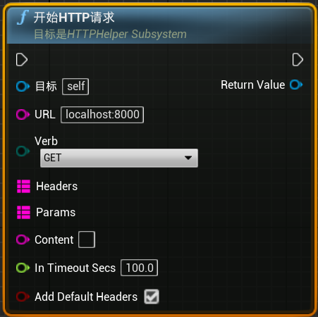
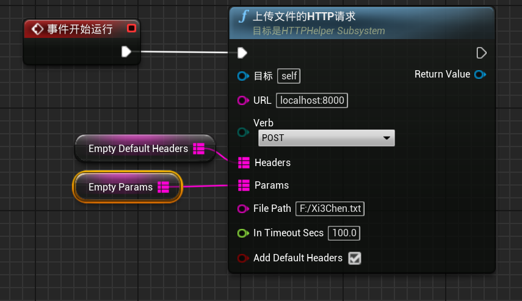
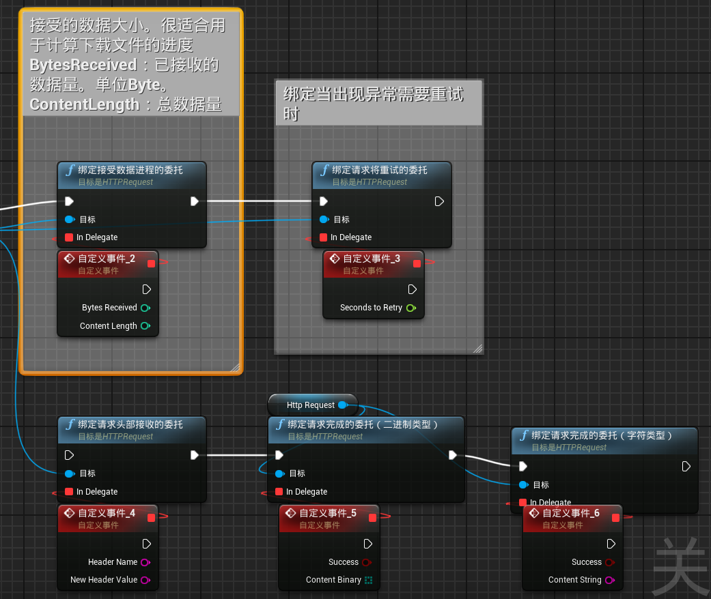

# UnrealWebUtils


一个简单的web技术栈会使用的通信协议插件，目前仅支持Http协议以及Http的上传下载文件。

# 能做什么？
1. HTTP通信（如果你只是为了HTTP通信，没有上传和下载文件的需求，建议使用[VaRest](https://github.com/ufna/VaRest)）
2. HTTP上传文件（支持multipart/form-data和application/octet-stream方式）

# 不能做什么？
1. 内置JSON字符串解析。（随便找个免费的JSON插件就可以了）
2. UDP和TCP通信。（建议使用[ObjectDeliverer](https://github.com/ayumax/ObjectDeliverer)插件）

# 如何使用
## 1. HTTP通信
通信需要使用`HTTPHelperSubsystem`进行。所有的Http请求函数都从CallHTTP开始。`HTTPHelperSubsystem`是GameInstanceSubsystem类型。可以在任意的Object类型中使用。即使切换关卡，也能在切换关卡的过程中继续工作。但请注意：Actor和Component会随着关卡切换而消失。可能会导致接收不到完成的事件。

### 函数功能快速预览

#### CallHttp：

基本的Http请求。需要给定Headers和Params和Content。可以完成Get的所有内容。不适合上传文件操作。可以使用`MakeDefaultContentType`来快速给定ContentType



#### CallHTTPAsFiles 上传多个文件或者文本

如果上传的是文本内容则不需要打开IsFile。否则必须打开。当UploadContent中包含内容时，ContentInfo将作为文件名。否则将自动将ContentInfo做为文件路径文件加载并上传


#### CallHTTPAsBinary 上传单个数据并支持自定义内容

如果需要将UE中计算的值或者将已加载的文件或者数据传给服务器，则使用CallHTTPAsBinary。注意！本示例中使用`X-File-Name`设定数据为文件名`Xi3ChenName.txt`的内容。内容是将本人的ID名作为文件上传。如果不使用上传文件的方式，可能需要特定的Header或者param。


#### CallHTTPAndUploadFile 上传本地文件。
一般只需要填写目标的URL即可


#### 事件分发器讲解
每个CallHttp返回的对象中都包含绑定的时间分发器。搜索Bind即可快速查找


### 基本请求流程
Http请求流程：
1. 准备Header和params。并更具需要准备Content。
2. 选择合适的CallHTTP函数。
3. 如果需要确定服务器返回的状态。请绑定对应的事件。
4. 处理事件。例如转换为json或者保存文件等操作。


# 如何部署服务器测试
我这里有个简单的服务器代码。当用户上传文件时，将文件保存在脚本所在位置。当用户需要获取脚本所在位置的任意文件时候，则传回。
## 简单的HTTP服务器（使用Pythone）
该代码在Pythone3.7上正常运行:
```python
import http.server
import socketserver
import os
import cgi
import urllib.parse

class MyHandler(http.server.BaseHTTPRequestHandler):
    CHUNK_SIZE = 8192  # 8KB chunks
    
    def do_GET(self):
        parsed_path = urllib.parse.urlparse(self.path)
        query_params = urllib.parse.parse_qs(parsed_path.query)
        
        if 'file' in query_params:
            file_name = query_params['file'][0]
            file_path = os.path.join(os.path.dirname(__file__), file_name)
            
            if os.path.exists(file_path):
                file_size = os.path.getsize(file_path)
                
                # 处理断点续传
                range_header = self.headers.get('Range')
                if range_header:
                    try:
                        start_range = int(range_header.replace('bytes=', '').split('-')[0])
                        self.send_response(206)  # Partial Content
                        self.send_header('Accept-Ranges', 'bytes')
                        self.send_header('Content-Range', f'bytes {start_range}-{file_size-1}/{file_size}')
                        remaining_size = file_size - start_range
                    except Exception:
                        start_range = 0
                        remaining_size = file_size
                        self.send_response(200)
                else:
                    start_range = 0
                    remaining_size = file_size
                    self.send_response(200)
                
                self.send_header('Content-type', 'application/octet-stream')
                self.send_header('Content-Length', remaining_size)
                self.send_header('Content-Disposition', f'attachment; filename="{file_name}"')
                self.end_headers()
                
                try:
                    with open(file_path, 'rb') as file:
                        if start_range:
                            file.seek(start_range)
                        
                        bytes_sent = 0
                        while bytes_sent < remaining_size:
                            chunk_size = min(self.CHUNK_SIZE, remaining_size - bytes_sent)
                            chunk = file.read(chunk_size)
                            if not chunk:
                                break
                            self.wfile.write(chunk)
                            bytes_sent += len(chunk)
                            
                            # 打印下载进度
                            progress = (start_range + bytes_sent) * 100 // file_size
                            print(f'\rDownloading {file_name}: {progress}% '
                                  f'({start_range + bytes_sent}/{file_size} bytes)', 
                                  end='', flush=True)
                        
                        print()  # 打印换行
                except ConnectionError:
                    print(f"\nDownload of {file_name} was interrupted")
                    return
                
            else:
                self.send_error(404, 'File not found')
        else:
            self.send_response(200)
            self.send_header('Content-type', 'text/html')
            self.end_headers()
            self.wfile.write(b"<html><body><h1>Hello World</h1></body></html>")

    def do_POST(self):
        content_type = self.headers.get('Content-Type')
        
        if content_type == 'application/octet-stream':
            content_length = int(self.headers.get('Content-Length', 0))
            file_content = self.rfile.read(content_length)
            file_name = self.headers.get('X-File-Name', 'unnamed_file')
            self.save_file(file_name, file_content)
        
        elif content_type.startswith('multipart/form-data'):
            form = cgi.FieldStorage(
                fp=self.rfile,
                headers=self.headers,
                environ={'REQUEST_METHOD': 'POST'}
            )
            for field in form.list:
                if field.filename:
                    file_content = field.file.read()
                    self.save_file(field.filename, file_content)
                else:
                    # 处理文本数据
                    text_content = field.value
                    text_filename = f"{field.name}.txt"
                    self.save_file(text_filename, text_content.encode('utf-8'))
        
        self.send_response(200)
        self.end_headers()
        self.wfile.write(b"File(s) and/or text data received and saved successfully")

    def save_file(self, file_name, content):
        file_path = os.path.join(os.path.dirname(__file__), file_name)
        with open(file_path, 'wb') as f:
            f.write(content)

if __name__ == "__main__":
    PORT = 8000
    print(f"Starting server at port {PORT}...")
    with socketserver.TCPServer(("", PORT), MyHandler) as httpd:
        print(f"Server is running at http://localhost:{PORT}")
        httpd.serve_forever()
```

## 关于服务器的吐槽
某次开发中，用户反馈文件下载没有进度了。我找了很久的原因。结果是服务器将下载进度取消掉了。上游的错误在下游出现，大家只会怪下游的人。

总结：人只会伤害最近的人。

# 适用的引擎版本
目前只在4.27和5.0上做测试过。版本适配的工作量不大。
另：本插件理论支持在Html5平台上运行。但是不支持最重要的上传本地文件功能。

# 感想
不知不觉我已经开源了三个插件，共计4个项目。如果对你有帮助。请点击小星星。你的支持是我最大的鼓励。

# 版权说明
本插件的图标来自[阿里巴巴矢量图标库](www.iconfont.cn),作者是：[johwar](https://www.iconfont.cn/user/detail?spm=a313x.search_index.0.d214f71f6.4a393a81k7HUhq&uid=12056883&nid=XWTEV8eTk3Yy)

有空了我会自己画一个